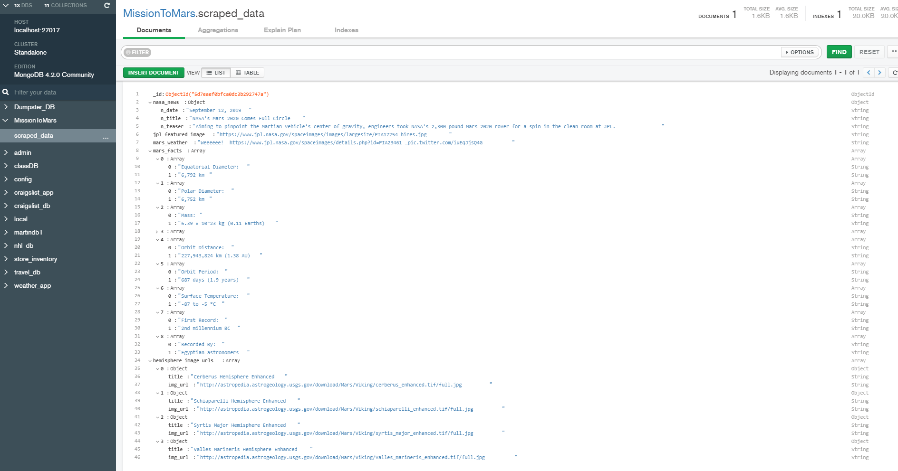

# WebScrapingChallengeHW

## Comments to homework

### Functionality

Deliverable works as expected, page is built dynamically using Flask from template html
which is populated with data from mongo database which was previoudly craped.
Page layout follows provided blueprint, in the page header (jumbotrone) there is
a small text with date of last scrape run.

User can refresh data by click on [Scrape New Data] button. This call /scrape point,
which redirect back to the frontpage when scraping is done. 

The scraping of link from JPL page needs to follow multiple link.
The first navigtion was causing issue, I used following conctruct to overcome the isssue:

```python
# From scrape_mars, scrape_jpl():
browser.is_element_not_present_by_text('more info', wait_time=2)
```
It uses time delay which far from perfect solution, I could not find a way to get back
result of the page load. Such cases can be handled by callback function.

### Programs

Programs are located in Mission_to_Mars folder:
1. mission_to_mars.ipynd - Jupyter notebook which was used to develop scraping code
2. app.py - Flask application
3. scrape_mars.py - web scraper used by Flask application

Since Chrome on my PC has limitation set by IT the chromedrive does not work as expected.
Therefore I used geckodriver.exe, which did work.

### Input Data

As mentioned in the class the current weather is not availble now due to Mars solar conjunction.
The code which scraps the page takes the latest value, which is set to "Wheeeee!" during this event 
(not intended as an extract challenge, right?). 

### Data Storage

Data is stored in MongoDB database MissionToMars, collection scraped_data.
Application refre




### Other deliverables

Documents folder contain snaphots of front page: PageTop.png, PageBottom.png 

